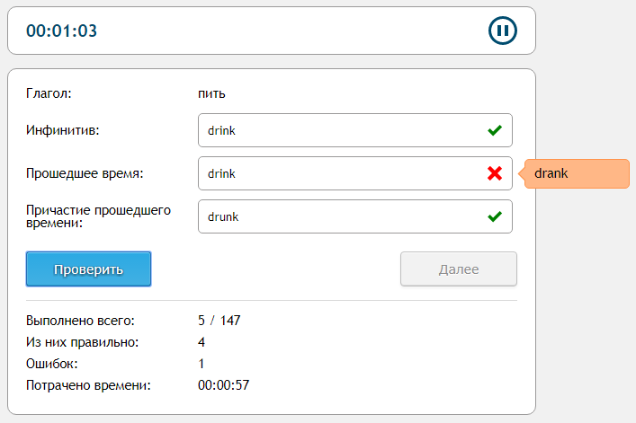

## Тренажер неправильных глаголов
Оффлайновое single-page приложение, написанное на JavaScript, и предназначенное для закрепления изученных неправильных глаголов английского языка.

Задумывалось как пробный проект JavaScript, в ходе реализации которого были закреплены полученные знания "нативного" JavaScript, а также освоены некоторые новые. Кроме того, до сих пор периодически используется в целях поддержания скила "Irregular Verbs" на должном уровне :)

При реализации проекта сознательно не использовались какие-либо библиотеки и/или фреймворки.

## Внешний вид

## Что умеет
 * В случайном порядке предлагает глаголы для тренировки, пока не будут пройдены все
 * Имеется встроенный таймер, который можно ставить на паузу
 * Учитывает количество правильных и неправильных ответов
 * При неправильных ответах показывает правильный вариант

## Использование
 1. Скачать папку "trainer"
 2. Запустить в ней файл "index.html"

## Планы по развитию
 1. Добавить режим работы "En -> Ru"
 2. Добавить режимы работы "Фразовые глаголы (Ru -> En)" и "Фразовые глаголы (En -> Ru)"
 3. Переработать систему модулей

